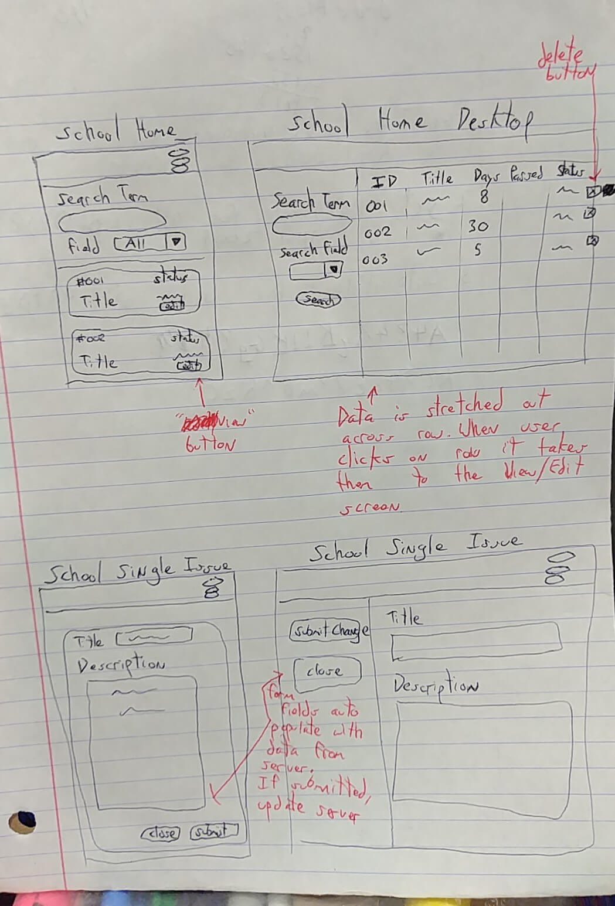
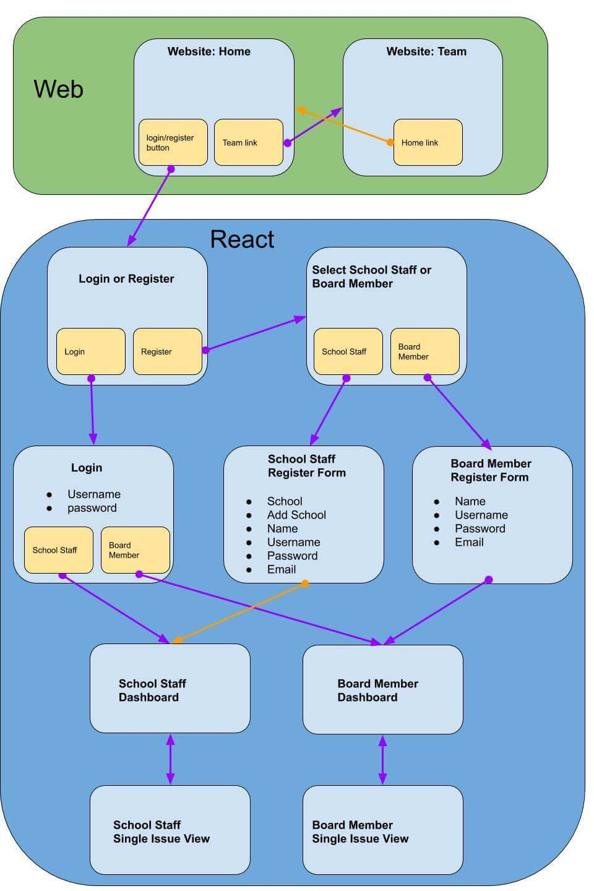

For my second Build Week at Lambda School I chose to build an app for managing small schools.  

The app will have two types of users: School Staff Members and Board Members. School Staff users can post issues at their school on the dashboard. Board Members can then read the issues and comment on them or change the status.

### Day One 9-20-2019  

I met my team. We have one Web Developer, four React Developers, and one Back End Developer.  

We did not have a UX Designer or any designs to start with so I made some simple wire frames with pen and paper. The group liked my designs.

After creating the wire frame sketch I made  a flow chart  to try to determine what pages our app would need and how users would navigate between them. I used Google Draw to make the flow chart. My team couldn't liked the flow chart so those we the pages we decided to make.  

### Day Two 9-21-2019  

On Saturday I started making a prototype in Adobe XD.  

### Day Two 9-21-2019  

Sunday I completed my prototype by making designs for every screen a user would see on mobile and desktop views.
