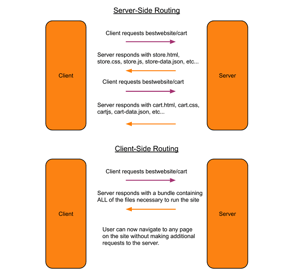

React Router is a library used to implement Client-Side Routing in web-based applications. It is an alternative to Server-Side Routing.  

Both types of routing begin with the user( referred to as the client ) requesting a page from a server by entering the address for that page into their browser. How the server responds is where client-side and server-side routing differ.  

### Server-Side Routing  

Server-Side routing has been around for many years. When a client requests a page from the server such as 'bestwebsite/store' the server sends back the store.html page as well as the CSS , Javascript, and other assets required to render the page.  

When the user navigates to a different page on the same website the user's device( client ) must send another request to server for the page they want to view. This can cause a delay when navigating between pages for the user. 

An additional negative aspect of server-side rendering is that it increases the amount of processing the server must do. This leads to higher infrastructure operating cost for the  app provider.

### Client-Side Routing

In client-side routing the server will send the  the client the entire web application. That means the user will receive every page along with all of the HTML, CSS, Javascript, images, etc... that are necessary to run the app. Once the user's device has recieved this data from the server they do not need to make additional requests. When the user changes pages within the app  they already have all of the page stored in their device. This makes the app appear to run faster than those that use traditional server-side rendering.  

This type of routing also reduces the number of times a server must process a request for each individual client. Lower processing time means decreased infrastructure cost.  

One disavantage of this technology is that the initial downlaod may be quite large. This could cause a delay on slow connections.  

Client-Side routing does not mean that the client only makes one request to the server ever. It will still communicate with the server to read, modify, and delete data as the user performs actions within the app.  

  


### React Router  

React Router is library for use with React applications that allows developers to implement client-side routing within their applications.  

The official documentation can be found here:  
[ React Router ](https://reacttraining.com/react-router/web/example/basic)

Let's looks at the basic components of React Router and how to use them.

#### Install React Router  

Add the React Router library to your React app with this command:  

```
npm i react-router-dom
```

#### BrowserRouter Component  

The BrowserRouter component is the backbone of a client-side routing setup. Only one of these components is necessary in an application. This component creates a 'history' object which is similar to the history object in a browser. BrowserRouter uses the history object to route the user to different pages of the app. When a user clicks the 'forward' or 'back' buttons in their browser window BrowserRouter will use the history object to determine what page to load.  

The first step to implement client-side routing in React is to 'wrap' the application within the BrowserRouter component. It is common practice to rename 'BrowserRouter' to 'Router'.  

```js
Index.js  

import { BrowserRouter as Router } from  'react-router-dom'

ReactDom.render(
  <Router>
    <App>
  </Router>,
  rootElement
);
```

Now that `<Router>` is wrapping the application we can use the two other main components of React Router: ` Route` and `Link`.

#### Route  

The `<Route>` component is used to render different components on your page. It gives the illusion of navigating to a different page, when it is actually just changing elements on the DOM.  

This is how to use a route component:  


```js
import { Route } from 'react-router-dom'
...
<Route path='/' component={ Home }>
```  

Route requires as least two properties in order to function. A 'path' prop and one of 'component', 'render', or 'children'.  

Path Prop  
  : The path prop tells the route WHEN to render a component. If the location.pathname equals the path contained in this prop, `Route` will render the component.  

  Component Prop  
    : This tells the Route component what to render when the path is a match.  


  Render Prop  
    : Similar to the 'component' prop, this tells the Route component what to render when the path is a match. However, the 'render' prop takes an expression as an arugment. This expression can be used to pass props down to the component which will be rendered.   

  Children Prop  
    : When the 'children' prop is used the speficied component will always be mounted to the DOM even if the path does not match. This can be useful for navbars and footers that appear across multiple pages.  

#### Link Component  

The `<Link>` component is render on the DOM as an `<a>` tag. React Router adds some special props to it.

Link only requires one prop, 'to'. The value of 'to' can be a string, object, or function. When a user click on the `<Link>` any `Route` components within the app with a 'path' prop that matches the value of 'to' will be triggered. Then the Route component will mount the component provided to its second argument.

```js
import { Route, Link } from 'react-router-dom'

<Link to='/store'>Store</Link>
<Route path='/store' component={ Store }/>

```


Here is a demo which demonstrates the basics of React Router on CodeSandbox.io:  
[ React Router Basic ]( https://codesandbox.io/s/react-router-practice-xw2q6 )


This demo utilizes some of the more advanced features of React Router such as creating nested routes and changing the pages with methods from the history object:  
[ React Router Advanced ]( https://codesandbox.io/s/react-router-avengers-demo-3spo9)
